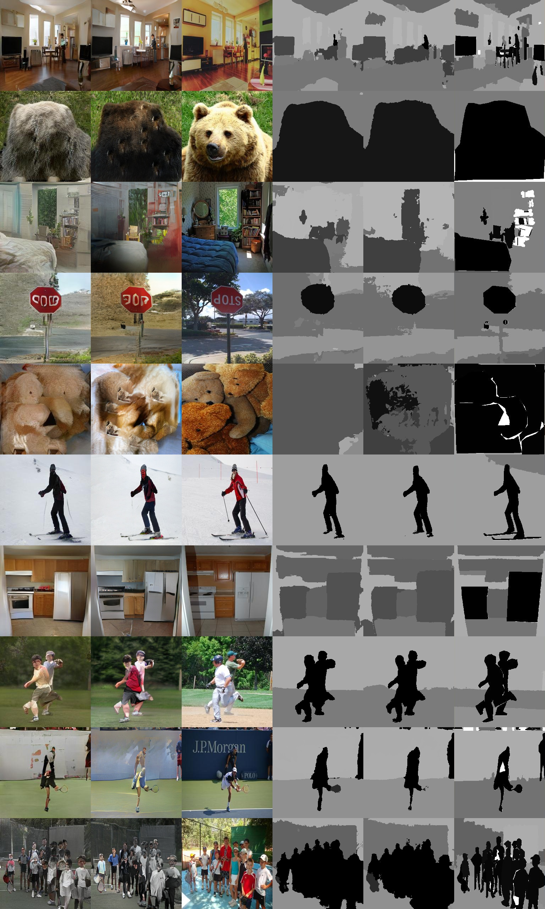

# SPADE-Paddle
使用Paddle2.1复现带SPADE正则化的像素风格迁移网络。

## 一、复现效果

下图为coco2017数据集验证集前10张图片（非刻意挑选）生成效果对比。左一列为复现效果，左二列为pytorch模型生成效果，左三列为数据集原图，右边三列为对应的deeplabv2模型（原论文采用：[https://github.com/kazuto1011/deeplab-pytorch](https://github.com/kazuto1011/deeplab-pytorch) ）的语义分割图。验证集前100张图片（非刻意挑选）生成效果对比图存放在 result 文件夹下。

将两个模型生成的图片通过分割模型测试的数据如下：

|  | Pixel Accuracy | Frequency Weighted IOU |
| -------- | -------- | -------- |
| Pytorch 模型     | 0.71063813     | 0.62763964     |
| Paddle 模型    | 0.71857583     | 0.63593917     |

## 二、训练

（本项目的“包括额外预训练模型和数据标注的”一键运行版本已公开在 AI Studio 上：[https://aistudio.baidu.com/aistudio/clusterprojectdetail/2192011](https://aistudio.baidu.com/aistudio/clusterprojectdetail/2192011)）

### 1. 数据集处理

模型训练，需要使用coco2017数据集中的“train2017.zip”、“val2017.zip”、“stuffthingmaps_trainval2017.zip” 三个文件，可在[此处](https://github.com/nightrome/cocostuff)下载。 其中，train2017.zip 中的图片文件解压复制到 dataset/coco_stuff/train_img 文件夹下，stuffthingmaps_trainval2017.zip 中的训练集语义分割标签 png 图片解压复制到 dataset/coco_stuff/train_label 文件夹下。

额外需要的“实例+语义分割标签”，我已用脚本处理好，可在百度网盘 [https://pan.baidu.com/s/162Ogv-JzKSmzzWfP0iPW5A](https://pan.baidu.com/s/162Ogv-JzKSmzzWfP0iPW5A)上下载，提取码：“pdpd”。 这里的图片解压复制到 dataset/coco_stuff/train_inst 文件夹下。

### 2. 执行训练

所有的全局参数、超参都写到了 model/init.py 脚本里的 OPT 类里，可使用默认值或根据需求修改。训练执行以下命令调用训练：

`python train.py`

论文使用了通过 vgg19 预训练模型计算的 perceptual loss 增强生成效果，所以要启用 vgg loss，要先在 model/init.py 脚本的 OPT 类里设置 `self.no_vgg_loss=True`，然后将 vgg19 预训练模型的参数 vgg19pretrain.pdparams 复制到 vgg 文件夹下。权重可在百度网盘下载 [https://pan.baidu.com/s/1t5z_uAdNklnFrPfTYOUu9A](https://pan.baidu.com/s/1t5z_uAdNklnFrPfTYOUu9A) ，提取码 “pdpd”。

训练后的权重存储在 output/model 文件夹下，可用于继续训练和预测。

### 3.备注

训练脚本支持多 GPU 训练，调用命令如下：

`python -m paddle.distributed.launch train.py`

修改 model/init.py 脚本里 OPT 类的设置为：`self.norm_G='spectralspadesyncbatch3x3'`，以启用跨多 GPU 的 BN来增强生成效果。大BatchSize效果更好，BigGAN说的~~ 。

## 三、预测

可以使用上一步训练好的权重进行预测，也可以使用预训练权重预测。权重可在百度网盘下载 [https://pan.baidu.com/s/1p4Bpo2ymdA2C2VGp-wV3wA](https://pan.baidu.com/s/1p4Bpo2ymdA2C2VGp-wV3wA) ，提取码：“pdpd”。将下载的三个模型文件复制到 output/model 文件夹下即可。

预测执行以下命令调用预测脚本：

`python val.py`

预测输出的图片存储在 output_val/pics 文件夹下。

## 四、log

预训练模型的日志文件 log.npy 存放在 log 文件夹下，是使用 numpy.save() 存储的，使用 numpy.load() 读取即可。每个step存储一条log，共465798条。每条 log 存储7个loss部分，从左到右分别是：
1. g_loss_gan：生成器 loss
1. g_loss_feat：判别器多尺度特征 loss
1. g_loss_vgg：辅助 vgg19 预训练模型的 perceptual loss
1. g_loss_vae：使用子编码器学习的 style loss
1. d_loss：判别器总 loss ，是后面两项的和
1. d_loss_f：判别器判别生成图片的 loss
1. d_loss_r：判别器判真实成图片的 loss

